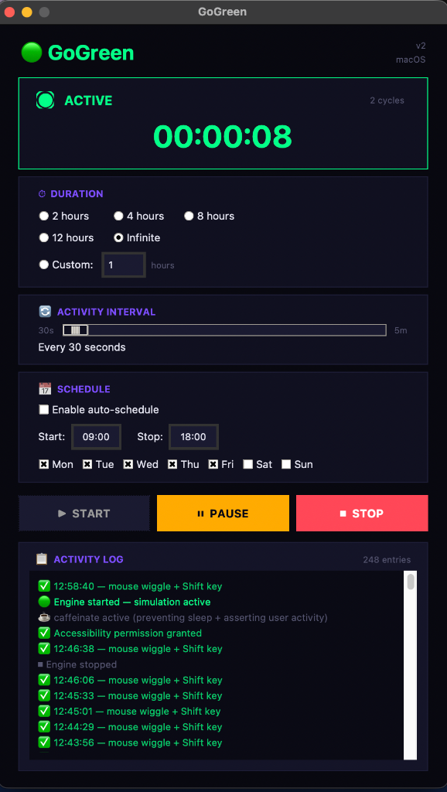
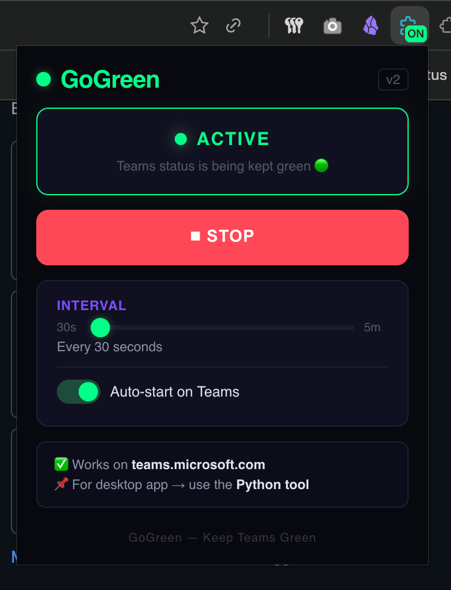

# 🟢 GoGreen v2 — Keep Microsoft Teams Status Green & Available (Always)

### The #1 open-source tool to keep your Microsoft Teams status "Available" — without installing anything.

<p align="center">
  
  
  
  
  
  
</p>

<p align="center">
  <strong>Tired of Microsoft Teams showing you as "Away" after 5 minutes?</strong><br>
  GoGreen keeps your Teams status green <em>permanently</em> — no software to install, no admin password, no pip packages.<br>
  <strong>Just copy → run → stay green. Works on corporate laptops.</strong>
</p>

<p align="center">
  
  &nbsp;&nbsp;&nbsp;&nbsp;
  
</p>

<p align="center">
  <em>🐍 Python Desktop Tool (left) &nbsp;•&nbsp; 🌐 Chrome Extension (right)</em>
</p>

---

## 📖 Table of Contents

- [The Problem](#-the-problem)
- [Two Solutions — Pick Yours](#-two-solutions--pick-yours)
- [🐍 Python Desktop Tool](#-option-a--python-desktop-tool)
- [🌐 Chrome Extension](#-option-b--chrome-extension)
- [Features](#-features)
- [How It Works](#-how-it-works)
- [Requirements](#-requirements)
- [FAQ](#-frequently-asked-questions)
- [Comparison with Other Tools](#-comparison-with-other-tools)
- [Contributing](#-contributing)
- [License](#-license)

---

## 😤 The Problem

Microsoft Teams automatically changes your status to **"Away"** after just **5 minutes of inactivity**. This happens when you:

- 🚶 Step away to grab coffee
- 📱 Switch to your phone for a call
- 📖 Read a document on paper
- 🍽️ Take a lunch break
- 🧠 Think deeply without touching the mouse

Your manager, your team, and your entire organization can see that yellow "Away" badge. It creates the impression you're not working — even when you are.

**There's no built-in way to disable this behavior in Microsoft Teams.**

---

## 🎯 Two Solutions — Pick Yours

GoGreen v2 offers **TWO ways** to keep your Teams status green. Choose the one that fits your situation:

| | 🐍 Python Desktop Tool | 🌐 Chrome Extension |
|---|:---:|:---:|
| **Works with** | Teams Desktop App + Web | Teams Web only |
| **Requires** | Python 3.7+ | Chrome/Edge browser |
| **Install needed** | No pip, no admin | No install — load unpacked |
| **OS support** | macOS + Windows | Any OS with Chrome |
| **Best for** | Desktop app users | Locked-down laptops (no Python) |
| **Simulation method** | OS-level input (real mouse/keyboard) | Page API override + DOM events |

> **🏢 Can't install Python?** Use the Chrome Extension.
> **💻 Using Teams desktop app?** Use the Python Tool.
> **🔥 Maximum coverage?** Use both.

---

## 🐍 Option A — Python Desktop Tool

**Best for:** Teams Desktop App users on macOS and Windows.

### Quick Start (30 Seconds)

**Download ZIP:**
1. Click the green **"Code"** button above → **"Download ZIP"**
2. Extract anywhere → Open Terminal/Command Prompt
3. Run:
   ```bash
   python3 main.py
   ```

**Or Git Clone:**
```bash
git clone https://github.com/SuperShary/GoGreen.git
cd GoGreen
python3 main.py
```

> **Windows:** Use `python main.py` instead of `python3`

**That's it. No `pip install`. No admin password. No virtual environment.**

### What's New in v2

- 🔐 **Permission detection** — shows warning if Accessibility permissions are missing (macOS)
- 🔘 **One-click fix** — button to open System Settings → Accessibility directly
- 🛡️ **`caffeinate -u` fallback** — asserts user activity even without Accessibility permissions
- 🖱️ **5px mouse wiggle** — more reliable than the 1px wiggle in v1
- ⌨️ **Multiple keyboard fallbacks** — Shift → F15 → keystroke
- 📋 **Bigger activity log** — scrollable, color-coded entries
- 🔢 **Cycle counter** — see exactly how many simulation cycles have run
- 🎨 **Darker, more futuristic UI** — near-black theme with neon green accents

### macOS: Accessibility Permission

GoGreen simulates mouse/keyboard input, which requires Accessibility permission:

1. Open **System Settings** → **Privacy & Security** → **Accessibility**
2. Add and enable your **Terminal** app
3. GoGreen v2 shows a **yellow warning banner** with a **one-click fix button** if permissions are missing

---

## 🌐 Option B — Chrome Extension

**Best for:** People who can't install Python, Chromebook users, or anyone using Teams in the browser.

### Quick Start (60 Seconds)

1. Download this repository (ZIP or clone)
2. Open Chrome → navigate to `chrome://extensions`
3. Enable **"Developer mode"** (toggle in top-right)
4. Click **"Load unpacked"**
5. Select the `chrome-extension` folder from this repository
6. Open **teams.microsoft.com** in Chrome
7. Click the GoGreen extension icon → **▶ START**

### How the Extension Works

The Chrome extension uses a **three-layer approach** specifically designed for Teams web:

| Layer | What It Does | Why It Works |
|---|---|---|
| **Visibility Override** | Makes `document.hidden` return `false` always | Teams checks this to detect tab switches |
| **Focus Override** | Makes `document.hasFocus()` return `true` always | Teams checks this for window focus |
| **DOM Event Simulation** | Dispatches mousemove, keydown, pointermove events | Backup activity simulation |

**Key advantage:** The extension **automatically activates** when you open Teams in the browser. No interaction needed after setup.

### Extension Features

- 🟢 **Auto-start** — activates automatically on `teams.microsoft.com`
- 🔄 **Adjustable interval** — 30 seconds to 5 minutes
- 🎨 **Dark theme popup** — matches the GoGreen aesthetic
- 📌 **Badge indicator** — shows "ON" when active
- 💾 **Persistent settings** — remembers your preferences
- 🚫 **Zero permissions abuse** — only accesses Teams domains

---

## 🎛️ Features

### ⏱️ Duration Control (Python Tool)
- **Presets**: 2 hours, 4 hours, 8 hours, 12 hours
- **Custom**: Enter any number of hours
- **Infinite mode**: Runs until you stop it manually

### 🔄 Adjustable Activity Interval
- Slide between **30 seconds** and **5 minutes**
- Both Python tool and Chrome extension support this

### 📅 Schedule Mode (Python Tool)
- Set **start time** and **stop time**
- Choose **active days** (Monday through Sunday)
- GoGreen auto-starts and auto-stops — no manual intervention

### 📋 Live Activity Log (Python Tool)
- Color-coded entries (✅ success, ⚠ warning, ❌ failure)
- Scrollable with 500+ entry capacity
- Cycle counter

### 😴 Sleep Prevention
- **macOS**: `caffeinate -diu` (display + idle + user activity)
- **Windows**: `kernel32.dll` `SetThreadExecutionState`

---

## ⚙️ How It Works

### Python Desktop Tool — OS-Level Simulation

```
╔══════════════════════════════════════════════════════════╗
║  Layer 1: 🖱️  MOUSE WIGGLE (5px)                        ║
║  → macOS: CoreGraphics via osascript (JXA)              ║
║  → Windows: user32.dll SetCursorPos via ctypes           ║
╠══════════════════════════════════════════════════════════╣
║  Layer 2: ⌨️  KEYBOARD PRESS (Shift → F15 fallback)      ║
║  → macOS: System Events via osascript                    ║
║  → Windows: user32.dll keybd_event via ctypes            ║
╠══════════════════════════════════════════════════════════╣
║  Layer 3: ☕  SLEEP PREVENTION + USER ACTIVITY            ║
║  → macOS: caffeinate -diu (display+idle+user)            ║
║  → Windows: SetThreadExecutionState (ES_DISPLAY_REQUIRED)║
╠══════════════════════════════════════════════════════════╣
║  Layer 4: 🛡️  FALLBACK (macOS, no permissions needed)    ║
║  → caffeinate -u -t 2 (asserts user activity at IOKit)   ║
╚══════════════════════════════════════════════════════════╝
```

### Chrome Extension — Page API Override

```
╔══════════════════════════════════════════════════════════╗
║  Layer 1: 👁️  VISIBILITY API OVERRIDE                    ║
║  → document.hidden → always false                        ║
║  → document.visibilityState → always "visible"           ║
║  → visibilitychange events → blocked                     ║
╠══════════════════════════════════════════════════════════╣
║  Layer 2: 🎯  FOCUS OVERRIDE                             ║
║  → document.hasFocus() → always true                     ║
║  → window blur events → blocked                          ║
║  → IdleDetector API → intercepted                        ║
╠══════════════════════════════════════════════════════════╣
║  Layer 3: 🖱️  DOM EVENT SIMULATION                       ║
║  → mousemove, keydown/keyup, pointermove events          ║
║  → Dispatched at configurable intervals                  ║
╚══════════════════════════════════════════════════════════╝
```

---

## 📋 Requirements

### Python Desktop Tool

| Requirement | Details |
|---|---|
| **Python** | 3.7 or later |
| **pip packages** | ❌ None — zero external dependencies |
| **Admin rights** | ❌ Not required |
| **Internet** | ❌ Not required (works offline) |

### Chrome Extension

| Requirement | Details |
|---|---|
| **Browser** | Chrome 111+ or Edge (Chromium-based) |
| **Install** | Load unpacked (Developer mode) |
| **Permissions** | Storage only — no broad access |

---

## 🖥️ Supported Platforms

| Platform | Python Tool | Chrome Extension |
|---|:---:|:---:|
| **macOS** (Intel & Apple Silicon) | ✅ | ✅ |
| **Windows 10/11** | ✅ | ✅ |
| **Linux** | 🔜 Coming soon | ✅ |
| **ChromeOS** | ❌ | ✅ |

---

## 🖼️ Screenshots

### 🐍 Python Desktop Tool

<p align="center">
  
</p>

**What you see above:**
- 🟢 **Active status** with pulsing green indicator, cycle counter, and live timer
- ⏱️ **Duration control** — presets (2h/4h/8h/12h), custom, or infinite
- 🔄 **Activity interval slider** — 30 seconds to 5 minutes
- 📅 **Schedule mode** — set start/stop times and active days
- ▶ ⏸ ⏹ **One-click controls** — Start, Pause, Stop
- 📋 **Activity log** — scrollable, color-coded, timestamped (248 entries shown)
- ✅ **Permission status** — shows Accessibility permission granted

### 🌐 Chrome Extension

<p align="center">
  
</p>

**What you see above:**
- 🟢 **Active status** — "Teams status is being kept green" with green glow
- ⏹ **Stop button** — one-click to deactivate
- 🔄 **Interval slider** — 30 seconds to 5 minutes
- 🔘 **Auto-start toggle** — automatically activates on Teams web
- 📌 **Badge indicator** — shows "ON" on the extension icon
- ℹ️ **Smart guidance** — tells users when to use Python tool vs extension

---

## ❓ Frequently Asked Questions

<details>
<summary><strong>Is GoGreen safe to use?</strong></summary>
<br>
Yes. The Python tool simulates a 5-pixel mouse movement and a Shift key press. The Chrome extension overrides page visibility APIs. Neither accesses Teams APIs, modifies system files, or transmits any data.
</details>

<details>
<summary><strong>Will my IT department detect this?</strong></summary>
<br>
GoGreen doesn't install software, create services, or modify the registry. The Python tool generates input identical to real user activity. The Chrome extension runs entirely within the browser. Most IT monitoring tools cannot distinguish GoGreen's activity from genuine usage.
</details>

<details>
<summary><strong>Does it work with the new Microsoft Teams?</strong></summary>
<br>
Yes. Both the Python tool and Chrome extension work with classic and new (Teams 2.0) versions.
</details>

<details>
<summary><strong>Can I use this on a company laptop?</strong></summary>
<br>
Yes — that's what GoGreen was designed for. If Python is available, use the desktop tool. If not, use the Chrome extension — it requires zero installation.
</details>

<details>
<summary><strong>Chrome extension vs Python tool — which should I use?</strong></summary>
<br>
If you use the <strong>Teams desktop app</strong>, use the Python tool. If you use <strong>Teams in the browser</strong>, either works, but the Chrome extension is simpler. If you can't install Python, the Chrome extension is your only option.
</details>

<details>
<summary><strong>Does GoGreen drain battery?</strong></summary>
<br>
Minimal impact. Activity is simulated once every 60 seconds by default. The sleep prevention feature does keep your display on, so consider plugging in for extended use.
</details>

<details>
<summary><strong>Does it work with Slack, Zoom, or other apps?</strong></summary>
<br>
The Python tool works with ALL apps since it simulates OS-level input. The Chrome extension only affects Teams web (teams.microsoft.com).
</details>

<details>
<summary><strong>Why no pip install?</strong></summary>
<br>
By design. Many corporate laptops restrict <code>pip install</code>. GoGreen uses only Python's standard library and OS-native tools. The Chrome extension also requires zero installation.
</details>

<details>
<summary><strong>How do I install the Chrome extension?</strong></summary>
<br>
1. Download this repo → 2. Open <code>chrome://extensions</code> → 3. Enable Developer mode → 4. Click "Load unpacked" → 5. Select the <code>chrome-extension</code> folder. That's it!
</details>

<details>
<summary><strong>Does the Chrome extension work on Edge?</strong></summary>
<br>
Yes! Microsoft Edge is Chromium-based and supports the same extension format. Follow the same steps but use <code>edge://extensions</code>.
</details>

---

## 🔧 Comparison with Other Tools

| Tool | Zero Install | Works Offline | Desktop App | Web App | Cross-Platform | GUI | Schedule | Free |
|---|:---:|:---:|:---:|:---:|:---:|:---:|:---:|:---:|
| **GoGreen (Python)** | ✅ | ✅ | ✅ | ✅ | ✅ | ✅ | ✅ | ✅ |
| **GoGreen (Chrome)** | ✅ | ✅ | ❌ | ✅ | ✅ | ✅ | ❌ | ✅ |
| Mouse Jiggler (USB) | ❌ | ✅ | ✅ | ✅ | ❌ | ❌ | ❌ | ❌ |
| Caffeine / Amphetamine | ❌ | ✅ | ❌ | ❌ | ❌ | ✅ | ❌ | ✅ |
| PowerToys Awake | ❌ | ✅ | ❌ | ❌ | ❌ | ✅ | ❌ | ✅ |
| PyAutoGUI scripts | ❌ | ✅ | ✅ | ✅ | ✅ | ❌ | ❌ | ✅ |
| AutoHotKey | ❌ | ✅ | ✅ | ✅ | ❌ | ❌ | ❌ | ✅ |

---

## 📁 Project Structure

```
GoGreen/
├── 🐍 Python Desktop Tool
│   ├── main.py          ← 🚀 Run this to start
│   ├── app.py           ← 🎨 Dark theme GUI
│   ├── engine.py        ← ⚙️ Simulation engine
│   ├── scheduler.py     ← 📅 Auto scheduling
│   └── settings.py      ← 💾 Settings persistence
│
├── 🌐 Chrome Extension
│   └── chrome-extension/
│       ├── manifest.json  ← Extension config (MV3)
│       ├── inject.js      ← Page API overrides (MAIN world)
│       ├── content.js     ← Extension messaging bridge
│       ├── background.js  ← Service worker
│       ├── popup.html     ← Extension popup UI
│       ├── popup.css      ← Popup styles
│       ├── popup.js       ← Popup logic
│       └── icons/         ← Extension icons
│
├── assets/              ← Screenshots
├── LICENSE              ← MIT License
├── README.md            ← This file
└── .gitignore
```

---

## 🤝 Contributing

GoGreen is open source and contributions are welcome!

1. **Fork** the repository
2. **Create** your branch: `git checkout -b feature/amazing-feature`
3. **Commit** your changes: `git commit -m 'Add amazing feature'`
4. **Push** to the branch: `git push origin feature/amazing-feature`
5. **Open** a Pull Request

### Ideas for Contributions
- 🐧 **Linux support** — `xdotool` based simulation
- 🖼️ **System tray icon** — minimize to menu bar / system tray
- 🌍 **Localization** — translate the GUI to other languages
- 📊 **Statistics** — track daily/weekly green time
- 🏪 **Chrome Web Store** — publish the extension publicly
- 🦊 **Firefox extension** — port to Firefox Add-ons

---

## ⭐ Star This Repo!

If GoGreen helped you stay green, give it a **⭐ star**!

Every star helps other people discover this tool. Let's build a movement. 💚

[](https://github.com/SuperShary/GoGreen)

---

## 📄 License

MIT License — free to use, modify, and distribute. See [LICENSE](LICENSE) for details.

---

## 🔑 Keywords

`keep teams status green` · `teams always available` · `prevent teams away status` · `microsoft teams green status` · `teams anti idle` · `teams mouse jiggler` · `teams status hack` · `keep teams active` · `teams away fix` · `corporate laptop teams status` · `no install teams green` · `teams status available python` · `prevent teams idle` · `teams status tool` · `remote work tools` · `work from home teams` · `teams always online` · `python mouse jiggler` · `cross platform teams tool` · `teams status keeper` · `teams chrome extension` · `teams web green status` · `teams browser extension` · `teams idle prevention`

---

<p align="center">
  <strong>Made with 💚 for every remote worker who deserves a coffee break without judgment.</strong>
</p>

<p align="center">
  <sub>⚠️ Disclaimer: Use GoGreen responsibly and in accordance with your organization's IT and workplace policies. The developers are not responsible for any consequences arising from the use of this tool.</sub>
</p>
